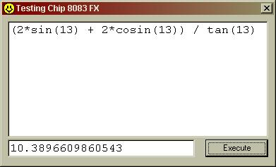



## Chip 8083 FX

### Description

Want to create scientific calculator? Today with

Chip 8083 FX you can do it very easy. This chip

is a kind of ActiveX DLL that handle simple math

expression. But... As a mater of fact, simple

but powerfull. You can use any expression, and

you can use more then 30 build-in functions.

If that's not ok for you, you can define your

own function and use it in your expression.

Try to use it, and you will know... Chip 8083 FX

is very powerfull tools that ever created!
 
### More Info
 

             |
---                |---
**Submitted On**   |2000-11-22 14:09:08
**By**             |[Derio](https://github.com/Planet-Source-Code/PSCIndex/blob/master/ByAuthor/derio.md)
**Level**          |Intermediate
**User Rating**    |4.8 (19 globes from 4 users)
**Compatibility**  |VB 5\.0, VB 6\.0
**Category**       |[Custom Controls/ Forms/  Menus](https://github.com/Planet-Source-Code/PSCIndex/blob/master/ByCategory/custom-controls-forms-menus__1-4.md)
**World**          |[Visual Basic](https://github.com/Planet-Source-Code/PSCIndex/blob/master/ByWorld/visual-basic.md)
**Archive File**   |[CODE\_UPLOAD1191611222000\.zip](https://github.com/Planet-Source-Code/derio-chip-8083-fx__1-13006/archive/master.zip)

